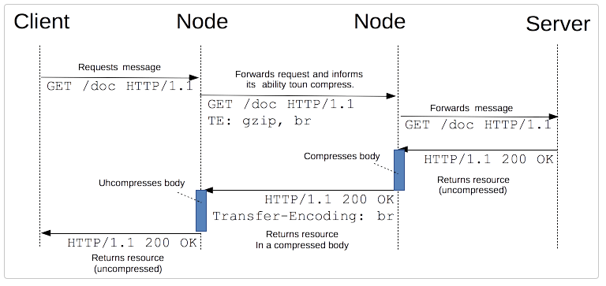

# 교차 출처 리소스 공유 (CORS)
CORS는 HTTP헤더를 사용해 한 출처에서 실행중인 웹 애플리케이션이 다른 출처의 선택한 자원에 접근할 수 있도록 권한을 부여하도록 브라우저에 알려주는 체제이다. 웹 애플리케이션은 리소스가 자신의 출처(origin)와 다를 때 교차 출처 HTTP 요청을 실행한다.
</br></br>
보안상의 이유로, 브라우저는 스크립트에서 시작한 교차 출처 HTTP 요청을 제한한다. 예를 들어, XMLHttpRequest나 Fetch API는 동일 출처 정책을 따른다. 즉 이 API를 사용하는 웹 애플리케이션은 자신의 출처와 동일한 리소스만 불러 올 수 있으며, 다른 출처의 리소스를 불려오려면 그 출처에서 올바른 CORS 헤더를 포함한 응답을 반환해야 한다.</br>
</br>

## 접근 제어 시나리오
모든 예제는 XMLHttpRequest를 사용합니다.
### 단순요청(simple requests)
일부 요청은 CORS preflight(* 본격적인 요청을 보내기 전, 서버 측에서 그 요청 메서드와 헤더에 대해 인식하고 있는지 확인하는 CORS 요청)를 발생시키지 않는다. 
simple requests는 다음 조건을 모두 만족한다.
- GET, HEAD, POST 중 하나의 메서드
- 유저 에이전트가 자동으로 설정한 헤더 외에, 수동으로 설정할 수 있는 헤더는 CORS-safelisted request-headers로 정의한 헤더 뿐이다.
    - Accept, Accept-Language, Content-Language, Content-Type(application/x-www-form-urlencoded, multipart/form-data, text/plain만 허용)
- 요청에 사용된 XMLHttpRequestUpload 객체에 이벤트 리스너가 등록되어 있지 않음
- 요청에 ReadableStream 객체가 사용되지 않음
</br>
브라우저는 헤더에 origin을 포함해 요청을 보내고, 서버는 이를 통해 출처를 확인한다. 서버는 이에 대한 응답으로 Access-Control-Allow-Origin 헤더를 다시 전송한다. 아래는 https://foo.example 이외의 도메인은 cross-site 방식으로 리소스에 접근할 수 없음을 나타낸다. 리소스에 대한 접근을 서용하려면 Access-Control-Allow-Origin 헤더에는 요청의 Origin 헤더에서 전송된 값이 포함되어야 한다.
```
Access-Control-Allow-Origin: https://foo.example
```

### 프리플라이트 요청
OPTIONS 메서드를 통해 다른 도메인의 리소스로 HTTP 요청을 보내 실제 요청이 전송하기에 안전한지를 확인한다. cross-origin 요청은 유저 데이터에 영향을 줄 수 있어 미리 전송(preflighted)하는 것이다.
```
const xhr = new XMLHttpRequest();
xhr.open('POST', 'https://bar.other/resources/post-here/');
xhr.setRequestHeader('Ping-Other', 'pingpong');
xhr.setRequestHeader('Content-Type', 'application/xml');
xhr.onreadystatechange = handler;
xhr.send('<person><name>Arun</name></person>');
```
위 예제에서, POST 요청과 함께 보낼 XML body를 만든다. 비표준 HTTP Ping-Other 요청 헤더가 설정된다. Content-Type이 application/xml이고, 사용자 정의 헤더가 설정되었기 때문에 이 요청은 preflighted 처리 된다.</br>
</br>
preflight request가 완료되면 실제 요청을 전송한다. 
아래 두 헤더와 함께 전송된다.
```
Access-Control-Request-Method: POST
Access-Control-Request-Headers: X-PINGOTHER, Content-Type
```
- Access-Control-Request-Method는 실제 요청에 사용할 메서드를 알린다. 
- Access-Control-Request-Headers는 실제 요청을 전송할 때 X-PINGOTHER와 Content-Type 사용자 정의 헤더와 함께 전송된다는 것을 서버에게 알린다. </br>

서버는 이러한 상황에서 요청을 수락할지 결정할 수 있다. 
```
Access-Control-Allow-Origin: http://foo.example
Access-Control-Allow-Methods: POST, GET, OPTIONS
Access-Control-Allow-Headers: X-PINGOTHER, Content-Type
Access-Control-Max-Age: 86400
```
응답에는 위와 같은 헤더가 포함된다. 허용되는 요청 정보를 나타낸다. Access-Control-Max-Age는 다른 preflight request를 보내지 않고 응답을 캐시할 수 있는 시간(초)를 나타낸다. 86400초(24시간). </br>

+ 모든 브라우저가 preflighted request 후 리다이렉트를 지원하지는 않는다. preflighted request 후 리다이렉트가 발생하면 일부 브라우저는 오류 메시지를 발생시킨다.

### Credential (자격 증명을 포함한 요청)
credentialed requests는 HTTP cookies와 HTTP Authentication 정보를 인식한다. 브라우저가 Access-Control-Allow-Credentials: true 헤더가 없는 응답을 거부한다.
</br>
Credential 요청인 경우, Access-Control-Allow-Origin에 와일드카드(*)를 사용할 수 없다. 명확한 출처를 지정해야 한다.

## HTTP 응답 헤더
#### Access-Control-Allow-Origin
단일 출처를 지정하여 브라우저가 해당 출처가 리소스에 접근하도록 허용. 또는 와일드카드 적용(*)
#### Access-Control-Expose-Headers
브라우저가 접근할 수 있는 헤더를 서버의 화이트 리스트에 추가
#### Access-Control-Max-Age
요청 결과를 캐시할 수 있는 시간을 나타냄
#### Access-Control-Allow-Credentials
credentials 플래그가 true일 때 요청에 대한 응답을 표시할 수 있는지를 나타냄. preflight request에 대한 응답의 일부로 사용하는 경우, credentials을 사용하여 실제 요청을 수행할 수 있는지를 나타낸다. 
#### Access-Control-Allow-Methods
리소스에 접근할 때 허용되는 메서드를 지정
#### Access-Control-Allow-Headers
preflight request 에 대한 응답으로 Access-Control-Allow-Headers 헤더가 사용된다. 실제 요청시 사용할 수 있는 HTTP 헤더를 나타낸다.

## HTTP 요청 헤더
#### Origin
cross-site 접근 요청 또는 preflight request의 출처
#### Access-Control-Request-Method
실제 요청에서 어떤 HTTP 메서드를 사용할지 서버에게 알려주기 위해, preflight request 할 때에 사용
#### Access-Control-Request-Headers
실제 요청에서 어떤 HTTP 헤더를 사용할지 서버에게 알려주기 위해, preflight request 할 때에 사용