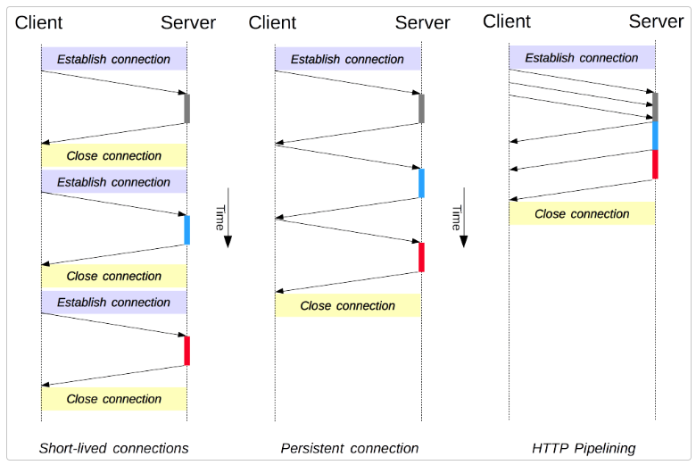
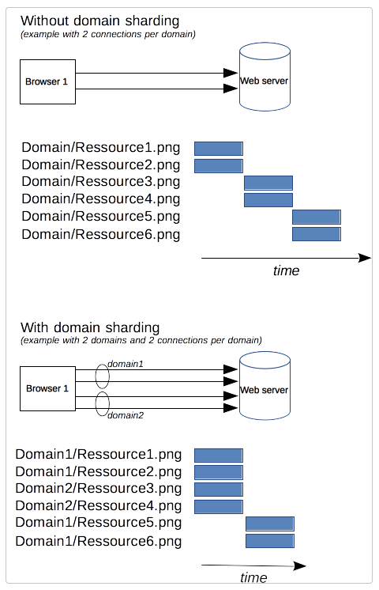

# HTTP/1.x의 커넥션 관리
대규모로 커넥션을 열고 유지하는 것은 웹 사이트 혹은 웹 애플리케이션의 성능에 많은 영향을 준다. HTTP/1.x에는 몇 가지 모델이 존재한다. -> 단기 커넥션, 영속적인 커넥션, HTTP 파이프라이닝</br>
HTTP는 클라이언트와 서버 사이의 단기 커넥션을 제공하는 TCP를 전송 프로토콜로 주로 사용한다. 초기에는 요청이 보내져야 할 때마나 커넥션을 매번 새롭게 생성하고 응답이 도착하면 닫는 형태의 단기적인 커넥션만 제공했다.</br>
TCP연결을 매번 여는 것은 자원을 매번 소비해 성능상으로 비효율적이다. 웹 페이지 하나에도 많은 요청들이 필요하기 때문에, 이런 형태의 모델은 적합하지 않다.</br>
HTTP/1.1에서 2가지 모델이 추가되었다. 영속적인 커넥션 모델은 연속적인 요청 사이의 커넥션을 유지한다. 새 커넥션을 여는데 필요한 시간을 줄일 수 있다. HTTP 파이프라이닝은 한 단계 더 나나가, 응답조차도 기다리지 않고 연속적인 요청을 보애 네트워크 지연을 더욱 줄인다.
</br>
HTTP 내 커넥션 관리는 end-to-end가 아닌 hop-by-hop이다. 클라이언트와 첫 번째 프록시 사이의 커넥션 모델은 프록시와 최종 목적 서버(혹은 중간 프록시들)간의 것과는 다를 수도 있다. Connection, Keep-Alive 등 커넥션 모델을 정의하는데 관여하는 헤더들은 hop-by-hop 으로, 중간 노드에 의해 값이 변경될 수 있다. </br>

## Short-lived connections
HTTP/1.0의 기본 커넥션은 단기 커넥션이다. HTTP 요청은 각각의 커넥션 상에서 실행된다. 요청 전에 TCP handshake가 발생하고 직렬화된다.</br>
TCP handshake는 자체로 시간을 소모하지만 지속적인 커넥션에 효과적이다. 단기 커넥션들은 이런 효율적인 특정을 사용하지 않고, 새로운 연결을 생성하므로 성능이 저하 된다. </br></br>
HTTP/1.0에서는 기본 모델이다. HTTP/1.1에서는 Connection 헤더를 close로 설정한 경우만 사용된다. 이 모델만 지원하는 경우를 제외하고는 굳이 이 모델을 사용하지 않는 것이 좋다.

## Persistent connections
새로운 연결을 맺는데 시간이 소요되고 TCP 연결이 지속적인 사용에 대해 성능이 좋아진다는 두 가지 문제를 완화하기 위해, Persistent connection 모델이 등장한다. (keep-alive 커넥션) </br>
커넥션을 여러 요청에 재사용해 TCP handshake비용을 줄이고, 성능 향상을 기대할 수 있다. 커넥션은 keep-alive 헤더를 사용해 연결을 얼마나 열어둘지 설정할 수 있다. </br>
단점도 있다. 실질적인 요청이 없는 경우에도 서버의 리소스를 소비하고, 과부하 상태에서는 Dos공격을 받을 수 있다.

## HTTP 파이프라이닝
HTTP요청은 순차적이다. 한 요청에 대한 응답을 받으면 다음 요청을 보낼 수 있다. 따라서 네트워크 지연과 대역폭 제한에 걸리면 상당한 딜레이가 발생할 수 있다. </br>
이러한 문제를 해결하기 위해, 파이프라이닝을 통해 응답을 기다리지 않고 요청을 연속적으로 보낼 수 있다. 두 개의 HTTP 요청을 하나의 TCP 안에 채워 성능을 향상시킬 수 있다. </br>
GET, HEAD, PUT, DELETE와 같은 imdempotent(멱등성) 메서드만 파이프라인으로 처리가 가능하다. 따라서 요청에 실패한 경우 단순하게 다시 요청을 보내면 된다. </br>
많은 프록시와 서버들이 파이프라이닝에 대해 제한을 가지고 있어 기본적으로 활성화되지 않는다.
```
참고: HTTP 파이프라이닝은 모던 브라우저에서 기본적으로 활성화되어있지 않습니다:

- 버그가 있는 프록시들이 여전히 많은데, 이들은 웹 개발자들이 쉽게 예상하거나 분석하기 힘든 이상하고 오류가 있는 동작을 야기합니다.
- 파이프라이닝은 정확히 구현해내기 복잡합니다: 전송 중인 리소스의 크기, 사용될 효과적인 RTT, 그리고 효과적인 대역폭은 파이프라인이 제공하는 성능 향상에 직접적으로 영향을 미칩니다. 이런 내용을 모른다면, 중요한 메시지가 덜 중요한 메시지에 밀려 지연될 수 있습니다. 중요성에 대한 생각은 페이지 레이아웃 중에도 진전됩니다. 그러므로 파이프라이닝은 대부분의 경우 미미한 수준의 향상만을 가져다 줍니다.
- 파이프라이닝은 HOL 문제에 영향을 받습니다.

이런 이유들로, 파이프라이닝은 더 나은 알고리즘인 멀티플렉싱으로 대체되었는데, 이는 HTTP/2에서 사용됩니다.
```

## 도메인 샤딩(deprecated)
순서가 없는 요청에 대해서도 HTTP/1.x connection은 직렬화를 수행항다. 대역폭이 큰 경우가 아니면 효울적이지 못하다. 이런 단점을 피하기 위해 브라우저들은 각 도메인에 대한 몇 개의 커넥션을 맺고 병렬로 요청을 보낸다(일반적으로 6개). 너무 많은 커넥션을 맺는다면 서버에서 Dos 보호 동작이 작동할 수 있다. </br>
서버가 더 빠른 애플리케이션 반응을 원한다면, 서버가 더 많은 커넥션을 열도록 강제할 수 있다. 예를 들어, 도메인을 몇개로 분할해 요청을 보낼 수 있다. 예로 3개의 도메인으로 분할해보자. 각각의 돔인들은 동일한 서버로 연결되고 각 도메인마다 6개의 커넥션을 맺는다면 총 18개의 커넥션을 사용할 수 있다. 이러한 기법을 도메인 샤딩이라고 부른다.</br>
</br></br>
도메인 샤딩은 현재 deprecated되어서 사용하지 않는 것이 좋다. HTTP/2 커넥션에서는 우선순위가 없는 병렬 요청들을 잘 다루고 있다. 도메인 샤딩은 성능 측면에서도 좋지 않다. 대부분 HTTP/2 구현체들은 우발적으로 일어나는 도메인 샤딩을 되돌리기 위해 connection coalescing(https://daniel.haxx.se/blog/2016/08/18/http2-connection-coalescing/)라는 기능을 사용한다.