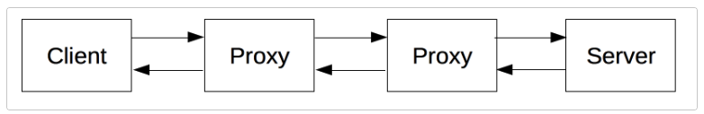
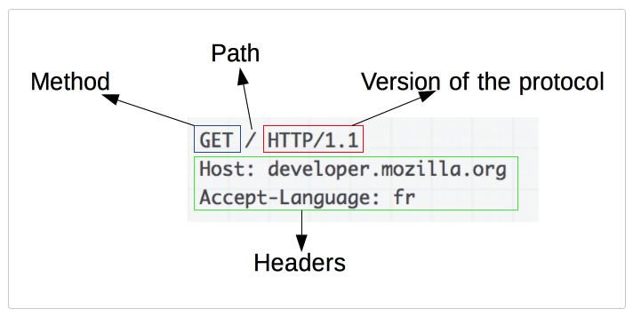
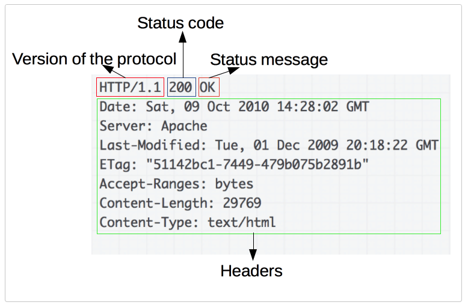

# HTTP 개요
HTTP는 리소스를 가져올 수 있도록 해주는 프로토콜이다. HTTP는 모든 웹에서 이루어지는 데이터 교환의 기초이며, 클라이언트 - 서버 프로토콜이기도 하다. </br>
HTTP는 애플리케이션 계층의 프로토콜로, TCP 또는 암호화된 TCP 연결인 TLS를 통해 전송된다. HTTP의 확장성 덕분에, 하이퍼텍스트 문서 뿐 아니라 이미지와 비디오 또는 HTML 폼 결과와 같은 내용을 서버로 POST하기 위해서도 사용한다. HTTP는 또한 필요할 때마다 웹 페이지를 갱신하기 위해 문서의 일부를 가져오는데 활용할 수 있다

## HTTP 기반 시스템의 구성요소
HTTP는 클라이언트 - 서버 프로토콜이다. 요청은 하나의 개체, 사용자 에이전트(또는 그것을 대체하는 프록시)에 의해 전송된다. </br>
각각의 개별적인 요청들은 서버로 보내지며, 서버는 요청을 처리하고 response를 제공한다. 이 요청과 응답 사이에는 여러 개체들이 있을 수 있다.(예 - 게이트웨이, 프록시 등)

실제 요청과 응답 사이에는 라우터 등 많은 컴퓨터가 존재하지만, HTTP는 애플리케이션 계층의 최상위에 있으므로 다른 레이어들과의 관련은 거의 없다.

### 클라이언트: 사용자 에이전트
사용자 에이전트는 사용자를 대신하여 동작하는 모든 도구이다. 주로 브라우저에 의해 수행된다. 브라우저는 항상 요청을 보내는 개체로, 서버가 될 수 없다. </br>
웹 페이지를 보여주기 위해, 브라우저는 HTML 문서를 가져오기 위한 요청을 전송하고 파일을 구문 분석하여 실행해야 할 스크립트 그리고 페이지 내 포함된 하위 리소스들을 잘 표시하기 위한 레이아웃 정보(CSS)에 대응하는 추가적인 요청을 가져온다.  그런 뒤 브라우저는 리소스들을 혼합해 웹 페이지를 표시한다.

### 웹 서버
통신 채널의 반대편에는 클라이언트에 의한 요청에 대한 문서를 제공하는 서버가 존재한다. 서버는 반드시 단일 머신일 필요가 없고, 여러 개의 서버를 동일한 머신 위에서 호스팅할 수 있다. HTTP/1.1과 Host 헤더를 이용하여, 동일한 IP 주소를 공유할 수 있다. 

### 프록시
[프록시](https://blog.naver.com/glgkwls1/223108645538)는 다양한 기능을 수행할 수 있다. -> 캐싱, 필터링, 로드밸런싱, 인증, 로깅

## HTTP 기본
#### HTTP는 간단하다.
HTTP 메시지들은 사람이 읽고 이해할 수 있어, 테스트가 쉽고 집입장벽이 낮다.
#### HTTP는 확장 가능하다.
HTTP 헤더는 HTTP를 확장하기 쉽게 만들어져있다. 클라이언트와 서버가 새로운 헤더의 시맨틱에 대해 간단한 합의만 한다면, 언제든디 기능을 추가할 수 있다.
#### HTTP는 상태가 없고, 세션이 있다.
HTTP는 Stateless하다. 동일한 연결 상에서 연속해 전달된 두 개의 요청 사이에는 연결고리가 없다. 이는 e-커머스 쇼핑 바구니처렁, 일관된 방식으로 사용자가 페이지와 상호작용하길 원할 때 문제가 생길 수 있다. 이를 위해 HTTP 쿠키를 이용해 상태가 있는 세션을 만들도록 해준다. 헤더의 확장성을 이용해, 동일한 상태를 공유하기 위해 각각의 요청들에 대한 세션을 만들도록 HTTP 쿠키가 추가된다.
#### HTTP와 Connection
Connection은 전송 계층에서 제어가 되기 때문에 근본적으로 HTTP 영역 밖이다. HTTP는 일반적으로 TCP 표준에 의존한다. 클라이언트와 서버가 HTTP 요청/응답을 교환하기 전에, 여러 왕복이 필요한 프로세스인 TCP연결을 설정해야 한다. 이는 요청을 여러번 보내는 경우, 효율적이지 못하다. 이런 부분을 개선하기 위해 HTTP/1.1은 파이프라이닝 개념과 지속적인 연결 개념을 도입했다. Conncetion헤더를 통해 부분적으로 TCP 연결을 제어할 수 있다. 

## HTTP 흐름
클라이언트가 서버와 통신하고자 할 때, 다음과 같은 과정을 수행한다.
1. TCP 연결을 연다. 클라이언트는 새 연결을 열거나 기존의 연결을 재사용하거나, 서버에 대한 여러 TCP 연결을 열 수 있다.
2. HTTP 메시지를 전송한다. 
```
GET / HTTP/1.1
Host: developer.mozilla.org
Accept-Language: fr
```
3. 서버에 의해 전송된 응답을 읽어들인다.
```
HTTP/1.1 200 OK
Date: Sat, 09 Oct 2010 14:28:02 GMT
Server: Apache
Last-Modified: Tue, 01 Dec 2009 20:18:22 GMT
ETag: "51142bc1-7449-479b075b2891b"
Accept-Ranges: bytes
Content-Length: 29769
Content-Type: text/html

<!DOCTYPE html... (here comes the 29769 bytes of the requested web page)
```
4. 연결을 닫거나 다른 요청들을 위해 재사용한다.

</br>
HTTP 파이프라이닝이 활성화되면, 첫번째 응답을 완전히 수싱할 때까지 기다리지 않고 여러 요청을 보낼 수 있다.

## HTTP 메시지
### 요청

#### HTTP 메서드
리소스를 대상으로 하는 행위(조회, 등록, 삭제 변경)를 나타낸다.
#### Path
프로토콜, 도메인, 포트를 제거한 리소스의 URL
#### HTTP 프로토콜의 버전
#### 헤더
서버에 대한 추가 정보를 전달하는 선택적 헤더들
### 응답

#### HTTP 프로토콜의 버전
#### HTTP 상태코드
요청의 성공 여부와 그 이유를 나타덴
#### Status message
아무런 영향력 없는, 상태 코드의 짧은 설명을 나타내는 메시지
#### 헤더
요청 헤더와 비슷한, HTTP 헤더들
#### 리소스가 포함되는 본문