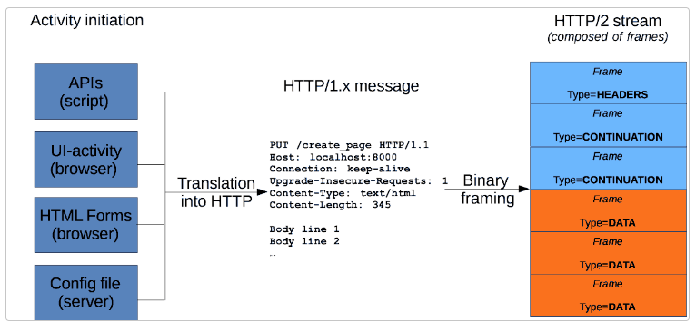
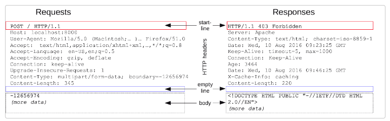
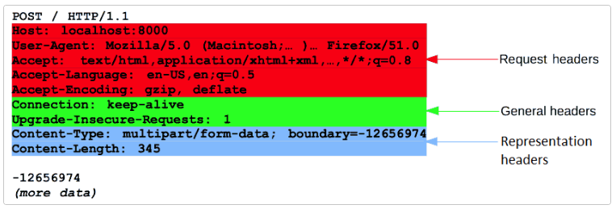
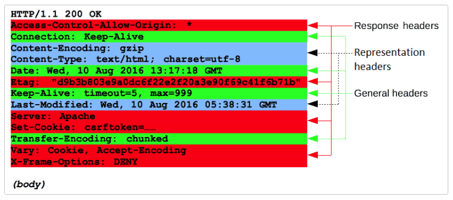
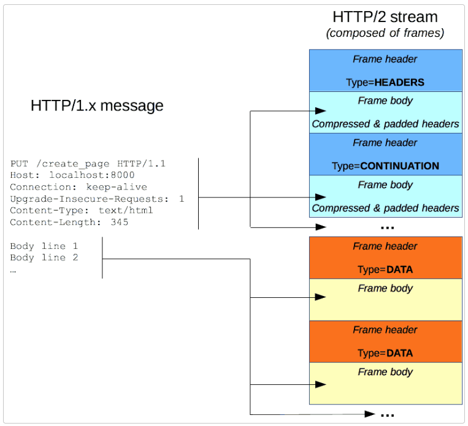

# HTTP 메시지
HTTP 메시지는 서버와 클라이언트 간에 데이터가 교환되는 방식이다. 메시지 타입은 요청과 응답 두 가지로 이루어져 있다.</br>
HTTP 메시지는 ASCII로 인코딩된 텍스트 정보이고, 여러 줄로 되어 있다. HTTP 프로토콜 초기 버전과 HTTP/1.1에서는, 클라이언트와 서버 사이의 연결을 통해 공개적으로 전달되었다. HTTP/2에서는 최적화와 성능 향상을 위해, HTTP 프레임으로 나누었다. HTTP 메시지는 설정 파일, API, 혹은 다른 인터페이스를 총해 제공된다. 

HTTP 요청과 응답의 구조는 아래와 같다.
- 시작 줄에는 실행되어야 할 요청, 또는 요청 수행에 대한 성공 또는 실패가 기록되어 있다. 항상 한 줄로 끝난다.
- 옵션으로 HTTP 헤더 세트가 들어간다. 요청에 대한 설명, 메시지 본문에 대한 설명이 들어간다
- 요청에 대한 모든 메타 정보가 전송되었음을 알리는 빈 줄이 삽입된다.
- 요청과 관련된 내용(HTML 폰 콘텐츠)이 옵션으로 들어가거나, 응답과 관련된 문서가 들어간다. 본문의 존재 유무 및 크기는 첫 줄과 HTTP 헤더에 명시된다.


## HTTP 요청
### 시작줄
- HTTP 메서드
   - GET, PUT, POST, HEAD, OPTIONS 를 사용해 서버가 수행해야 항 동작을 나타낸다.
- 요청 타겟
    - URL 또는 프로토콜, 포트, 도메인의 절대 경로로 나타낼 수도 있으며 요청 컨텍스트에 의해 특정지어 진다. 
    ```
    GET /background.png HTTP/1.0
    ```
- HTTP 버전 정보
### 헤더 
HTTP 전송에 필요헌 모든 부가 정보를 나타낸다. 
크게 General 헤더, Request 헤더, Representation헤더 로 나눌 수 있다.

### 본문 
모든 요청에 본문이 들어가지는 않는다. GET, HEAD, DELETE, OPTIONS와 같이 리소스를 가져오는 경우 보통 본문이 필요 없다. 서버에 데이터를 전송하는 경우 본문을 사용할 수 있다.

## HTTP 응답
### 상태줄
HTTP 응답의 시작 줄은 상태줄이다. 프로토콜 버전, 상태코드(예 - 200, 404), 상태 텍스트(OK, NOT FOUND)로 이루어져 있다.
```
HTTP/1.1 404 Not Found.
```
### 헤더
HTTP 전송에 필요헌 모든 부가 정보를 나타낸다. 
크게 General 헤더, Request 헤더, Representation헤더 로 나눌 수 있다.

### 본문 
payload없이 요청에 대한 응답으로 상태코드(201 Created, 204 No Content)만 가진 경우, 본문이 없을 수 있다.

## HTTP/2 프레임
HTTP/1.x 는 몇가지 성능 결함이 있다. 
- 본문은 압축이 되지만, 헤더는 압축이 되지 않는다.
- 연속된 메시지들은 비슷한 헤더 구조를 가지지만 메시지마다 반복되어 전송된다.
- 다중전송이 불가능하다. 서버 하나에 연결을 여러개 열어야 하고, 적극적인(warm) TCP 연결이 소극적인(cold) TCP 연결보다 효율적이다.
- HTTP/2에서는 추가적인 단계가 도입되었다. HTTP/1.x 메시지를 나누어 스트림에 끼워 넣는다. 데이터와 헤더 프레임이 분리 되었기 때문에, 헤더를 압축할 수 있다. 스트림 여러개를 하나로 묶을 수 있어서(멀티 플렉싱) TCP 연결이 효율적으로 이루어진다.
</br>

 
</br>개발자 입장에서, HTTP 프레임을 쉽게 살펴 볼 수 있게 되었다. HTTP 프레임은 HTTP/1.1 메시지와 기저가 되는 전송 프로토콜 사이의 HTTP/2에서 추가된 단계이다. HTTP 프레임 때문에 API바꿀 필요도 없다. 
