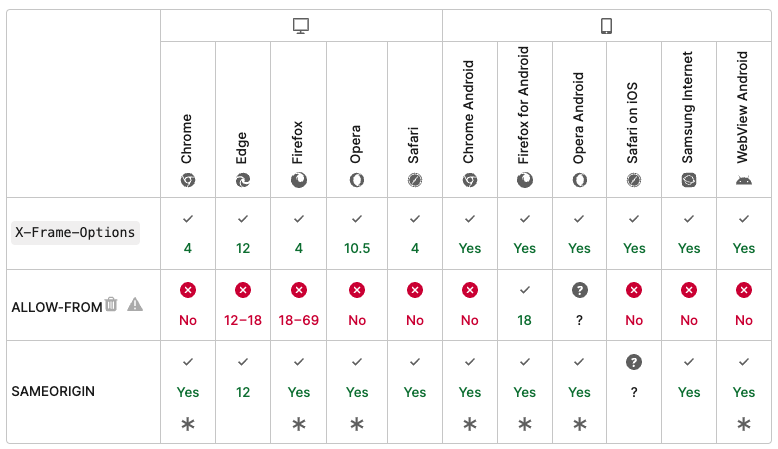

# X-Frame-Options
X-Frame-Options 설정을 통해 브우저가 해당 사이트를 'frame', 'iframe', 'embed', 'object' 태그 내부에서 렌더링 해도 되는지를 설정할 수 있는 헤더이다. 사이트 내 콘텐츠들이 다른 사이트에 포함되지 않도록 해 clickjacking 공격(https://en.wikipedia.org/wiki/Clickjacking)을 막기 위해 이 헤더를 사용한다.
* clickjacking: 'frame', 'iframe', 'embed' 등으로 다른 서버에 위치한 페이지를 삽입하여 다양한 공격에 사용할 수 있다

## Syntax
```
X-Frame-Options: deny
X-Frame-Options: sameorigin
X-Frame-Options: allow-from https://example.com/
```
deny는 같은 사이트 내에서 frame을 통한 접근도 막는다. sameorigin을 명시할 경우에는 frame에 포함된 페이지가 페이지를 제공하는 사이트와 동일한 경우 계속 사용할 수 있다.

#### deny
어떠한 사이트에서도 frame 상에서 보여질 수 없다.
#### sameorigin
동일한 사이트의 frame에서만 보여진다. 해당 스펙 안에서 브라우저 벤더가 최상위, 혹은 부모, 모든 체인에서 적용할지를 결정한다. 하지만 모든 조상이 동일한 사이트에서 제공되지 않는다면 유용하지 않다고 논의되고 있다.
#### allow-from uri
지정된 특정 uri의 frame에서만 보여진다. 

## 브라우저 호환성



</br></br></br></br></br>
------
- https://webhack.dynu.net/?idx=20161117.003&print=friendly
- https://en.wikipedia.org/wiki/Clickjacking
- https://developer.mozilla.org/ko/docs/Web/HTTP/Headers/X-Frame-Options

