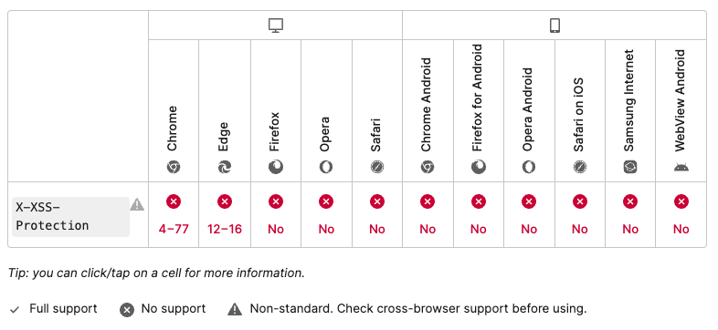

# X-XSS-Protection
공격자가 XSS 공격을 시도할 때 브라우저의 내장 XSS Filter를 통해 공격을 방지할 수 있는 헤더이다. 공격을 방지할 때 페이지 로드를 중단시킬 수 있다. 최신 브라우저는 Inline Javascript(unsafe-inline)사용을 못하게 하는 CSP 보호 기능이 있으나, 해당 기능을 지원하지 않는 구형 웹 브라우저에서 사용자를 보호할 수 있는 기능을 제공할 수 있다. 

## 문법
```
X-XSS-Protection: 0
X-XSS-Protection: 1
X-XSS-Protection: 1; mode=block
X-XSS-Protection: 1; report=<reporting-uri>
```
#### 0
XSS 필터링 비활성화
#### 1
XSS 필터링 사용(일반적으로 브라우저 기본값). 사이트 내에서 스크립팅 공격이 감지되면 브라우저는 안전하지 않은 영역을 제거 후에 렌더링한다.
#### 1; mode=block
XSS 필터링 사용. 공격이 감지되면 안전하지 않는 영역을 제거하는 것이 아니라, 페이지 렌더링을 제거 한다. 
#### 1;report=<reporting-URI> (Chromium에서만 사용 가능)
XSS 필터링 사용. XSS 공격을 탐지하면 브라우저는 페이지 렌더링을 차단하고 위반 사항을 보고한다. 

## 예제
### BASH
```
X-XSS-Protection: 1; mode=block
```
### PHP
```
header("X-XSS-Protection: 1; mode=block");
```
### Nginx
```
add_header "X-XSS-Protection" "1; mode=block";
```

## 참고
브라우저의 내장 XSS Filter에 의해 처리되므로 각 브라우저마다 처리 방식이 다를 수 있다. 모든 공격을 막을 수 없기 때문에 추가적으로 Filter를 설정해 방어할 수 있다.

## 지원 브라우저



</br></br></br></br></br>
--------------------------------------------------------
- https://developer.mozilla.org/ko/docs/Web/HTTP/Headers/X-XSS-Protection
- https://cyberx.tistory.com/171